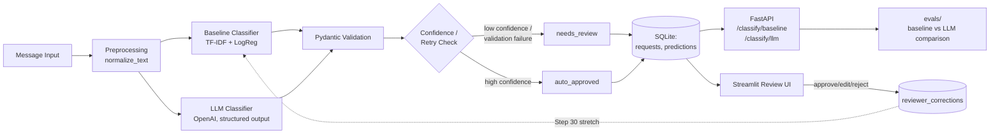

# civicinbox
AI-assisted request-triage system that classifies incoming messages, extracts structured details, and drafts reviewable responses for small organizations.

### Architecture

```mermaid
flowchart LR
    A[Message Input] --> B[Preprocessing<br/>normalize_text]
    B --> C1[Baseline Classifier<br/>TF-IDF + LogReg]
    B --> C2[LLM Classifier<br/>OpenAI, structured output]
    C1 --> D[Pydantic Validation]
    C2 --> D
    D --> E{Confidence /<br/>Retry Check}
    E -->|low confidence /<br/>validation failure| F[needs_review]
    E -->|high confidence| G[auto_approved]
    F --> H[(SQLite:<br/>requests, predictions)]
    G --> H
    H --> I[FastAPI<br/>/classify/baseline<br/>/classify/llm]
    H --> J[Streamlit Review UI]
    J -->|approve/edit/reject| K[(reviewer_corrections)]
    K -.->|Step 30 stretch| C1
    I --> L[evals/<br/>baseline vs LLM comparison]
```