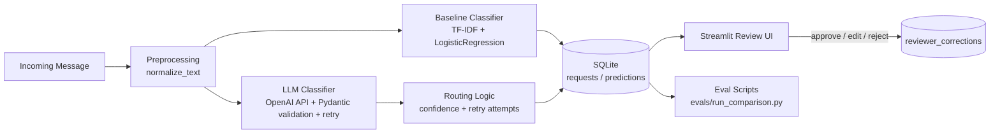

# civicinbox
AI-assisted request-triage system that classifies incoming messages, extracts structured details, and drafts reviewable responses for small organizations.


### Architecture



Baseline and LLM classification are separate, independently callable endpoints rather than a single merged pipeline — this is deliberate, so either model's output can be evaluated and compared without the other running. Only the LLM path goes through confidence/retry-based routing; the baseline has no `needs_review` concept. Reviewer corrections are written to a separate table from the original prediction, so raw model output is never overwritten — this preserves the data active learning (Step 12) will train on later.


### Technology Choices

| Tool | Purpose | Why it was selected |
|---|---|---|
| FastAPI | API layer for both classification endpoints | Typed request/response models via Pydantic, async support, automatic OpenAPI docs |
| Pydantic | Classification/extraction schema, request validation | Enforces the taxonomy at the boundary; raises `ValidationError` on malformed LLM output rather than silently accepting bad data |
| scikit-learn (TF-IDF + LogisticRegression) | Baseline classifier | Interpretable, no API cost, fast to iterate — sets the bar the LLM has to beat rather than assuming it automatically would |
| OpenAI API | LLM-based structured classification | Only paid service in the stack; used specifically where structured extraction quality matters |
| SQLAlchemy + SQLite | Persistence (`requests`, `predictions`, `reviewer_corrections`) | Declarative Core-style models keep a future Postgres swap to a connection-string change, without redesigning the schema |
| Streamlit | Read/write review UI | Fastest path to a usable human-in-the-loop screen; kept out of the Docker image (`ui` optional dependency group) since it isn't part of the served API |
| uv | Dependency management | Lockfile-based reproducibility (`uv.lock` committed); `--extra` groups keep dev-only and UI-only dependencies out of the production image |
| pytest + ruff | Testing and linting | 34 tests / 92% coverage gate CI; ruff enforces formatting and catches issues like the F811 duplicate-test bug caught this project |
| Docker | Containerized deployment | FastAPI-only image by design — Streamlit reads SQLite directly off disk and doesn't containerize cleanly without shared-volume complexity not worth it for an internal review tool |
| GitHub Actions | CI | Two jobs (`test`, `docker` gated on `test`) — trains the baseline fresh every run rather than trusting a committed artifact, and smoke-tests the container's `/health` endpoint |


### End-to-End Pipeline

1. **Input:** User submits a civic message (pasted text) via API or the Streamlit review screen's seeded data.
2. **Preprocessing:** `normalize_text()` lowercases, strips extra whitespace, and cleans trailing punctuation before either model sees the message.
3. **Model/retrieval:** Two independent classification paths run against the same normalized text:
   - `POST /classify/baseline` — TF-IDF + LogisticRegression, loads the fitted `.joblib` model.
   - `POST /classify/llm` — OpenAI structured-output call, extracting category, urgency, requested action, entities, missing information, and a draft response.
4. **Post-processing (LLM path only):** Pydantic validates the returned JSON against the taxonomy schema. On invalid JSON or a `ValidationError`, the request is retried within the same call; a raw `OpenAIError` (timeout, rate limit) is also retried, while a missing-API-key `RuntimeError` fails fast without retrying, since no retry count fixes a bad key.
5. **Validation/routing:** Confidence and retry-attempt count decide whether an LLM prediction is `auto_approved` or `needs_review`. The baseline has no routing step — it always returns a direct prediction.
6. **Output:** Both predictions are persisted to SQLite (`requests`, `predictions`, keyed by `model_type`) and returned as JSON matching the Pydantic response schema.
7. **Deployment:** FastAPI is served via Docker (health-checked in CI); Streamlit runs locally against the same SQLite file and is not containerized, by design.

A reviewer then works through the Streamlit screen: approving, editing, or rejecting each prediction. Edits are written to `reviewer_corrections`, never overwriting the original model output — so both the model's raw guess and the human's correction remain available for the eval report and future active-learning work.


### Problem Statement

1. **Who experiences the problem?** Small organizations — NGOs, university departments, local service offices — that receive a steady stream of unstructured requests by email or message, without dedicated triage staff.
2. **What currently makes it difficult?** Requests arrive as free text with no consistent structure. Staff manually read each one to figure out category, urgency, what's being asked, and what information is missing — a repetitive task prone to inconsistency, especially under volume.
3. **What decision or task does this system improve?** Given an incoming message, the system classifies it into one of six categories, extracts structured fields (urgency, requested action, entities, missing information), and drafts a reviewable response — reducing the manual read-and-triage step to a review-and-approve step.
4. **What is outside the scope of the project?** The system does not send responses automatically — every output requires human approval, edit, or rejection before anything goes out. It is not a general-purpose chatbot, and it does not handle multi-turn conversation or attachments.


### Solution

CivicInbox takes a single incoming message and runs it through two independent classifiers: a TF-IDF + LogisticRegression baseline and an OpenAI-backed structured extractor. Both write to the same schema, which makes it possible to compare them directly rather than assume the LLM performs better by default — on this project's 450-message labeled dataset, the baseline actually wins (macro-F1 0.835 vs. 0.679), a result documented in detail in the evaluation report rather than glossed over.

The LLM path extracts more than just a category: it produces urgency, requested action, extracted entities, missing information, and a draft response, all validated against a Pydantic schema before being trusted. Invalid or malformed output triggers a retry rather than a silent failure, and predictions below a confidence threshold — or that needed retries to parse — are routed to a `needs_review` queue instead of being auto-approved.

A reviewer works through pending predictions in a Streamlit screen, seeing both models' output side by side where available, and can approve, edit, or reject each one. Edits are stored separately from the original prediction, preserving the model's raw output alongside the human correction — data intended to support a future active-learning loop (retraining the baseline on corrected examples) rather than being discarded after review.

The project is deliberately narrow in scope: one input channel, a fixed six-category taxonomy, and no autonomous sending. The engineering emphasis is on evaluation rigor — a real baseline, a labeled test set, per-class error analysis — and on handling model uncertainty as a first-class product concern rather than trusting either model's output unconditionally.


### Evaluation

#### Dataset

450 labeled civic messages across 6 categories (`academic_records`, `financial_aid`, `registration`, `document_request`, `general_inquiry`, `complaint_escalation`) — 150 LLM-drafted, 300 user-authored, 75 messages per category. Full dataset composition disclosure, the urgency/category confound, and split methodology are documented in [`evals/README.md`](evals/README.md).

#### Baselines

TF-IDF + LogisticRegression, trained fresh on every CI run rather than relying on a committed model artifact, to keep the training script itself proven-working on a clean checkout.

#### Metrics

| Metric | Baseline | LLM |
|---|---:|---:|
| Macro-F1 | 0.835 | 0.679 (mean of 5 runs, range 0.669–0.692) |
| Weakest class | `academic_records` (F1 0.645) | `academic_records` recall 0.133 |
| Invalid-JSON rate | n/a | 0% after retry |
| % routed to `needs_review` | n/a | 0% |

The baseline outperforms the LLM by roughly 15 macro-F1 points, consistently across repeated runs — evidence for treating LLM classification as a hypothesis to test against a simple baseline, not a default assumption.

#### Error Analysis

The LLM's dominant failure mode: `academic_records` messages are almost always misrouted to `complaint_escalation` (13 of 15 true `academic_records` messages in the most recent run, precision 1.0 / recall 0.133 for that class). Confidence-based review routing does not catch this — the LLM's output is schema-valid and confidently wrong, so 0% of these errors were flagged for human review. This points to a genuine taxonomy-boundary ambiguity (a message like "pending transcript request" reads as either a request-about or a complaint-about an academic process) rather than an obviously fixable prompt bug.

Full per-class tables, all 5 individual LLM run results, and two additional documented cases (the review-routing blind spot in general, and a retry-recovery example on message `msg_376`) are in [`evals/README.md`](evals/README.md).


### Local Setup

```powershell
git clone https://github.com/moshood-abdulganiyu/civicinbox.git
cd civicinbox

uv sync --extra dev --extra ui
cp .env.example .env
uv run python scripts/init_db.py
```

Edit `.env` and add your own `OPENAI_API_KEY` (required only for the `/classify/llm` endpoint — the baseline classifier and Streamlit review screen work without it, though the review screen will only show predictions that already exist in the database).

`scripts/init_db.py` creates the SQLite tables (`requests`, `predictions`, `reviewer_corrections`) if they don't already exist — required before either the API or the Streamlit screen can run; without it, both fail with `sqlite3.OperationalError: no such table`.


### Run the Application

Backend API:

```powershell
uv run uvicorn app.main:app --reload
```

Visit `http://127.0.0.1:8000/docs` for interactive OpenAPI documentation. `/health` returns `{"status": "ok"}`.

Review UI (separate terminal):

```powershell
uv run streamlit run app/ui/review.py
```

Opens at `http://localhost:8501`. Requires the API's database to already have predictions in it — submit at least one message via `/classify/baseline` or `/classify/llm` first, or the screen will show an empty (not broken) table.

Test suite:

```powershell
uv run pytest --cov=app
```
